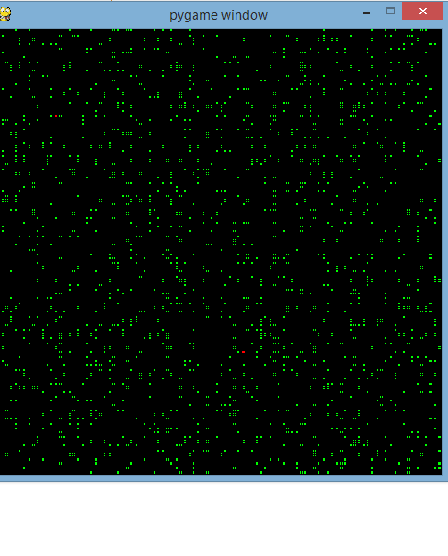

# Astar-with-graphics
This is an example of the Astar pathfinder alogorithm that will find the shortest path between two points.
The moving red dot simulates a robot which navigates through the green obstacles to find its stationary partner.

